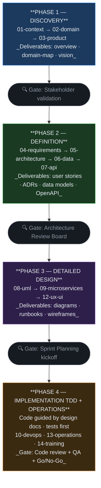

# SDD Guide — Software Design Documentation

> This document explains the **approach and methodology** that governs this entire repository.
> Read it first if you are new to the project or to the methodology.

---

## What is SDD?

**Software Design Documentation** is a development approach where design documentation
**precedes and guides** implementation. It is not about documenting what was already built —
it is about designing on paper before writing code.

```
Traditional:   Code  →  Documentation (if it ever happens)
SDD:           Documentation  →  Code  →  Updated documentation
```

### The 3 SDD principles

1. **Design before code:** A reviewed and approved design document is the prerequisite
   for starting implementation. If it is not documented, it does not exist yet.

2. **Living documentation:** Documentation is updated with every change. An outdated
   document is technically incorrect — it is code with bugs, written in prose.

3. **Traceability:** Every line of code has a requirement that justifies it. Every
   requirement has a test case. Every test case has a result.

---

## SDD workflow phases



---

## Recommended fill-in order for a new project

### Week 1 — Context and Domain
1. `01-context/overview.md` — What are we building?
2. `01-context/scope.md` — What are we NOT building?
3. `02-domain/domain-map.md` — What are the bounded contexts?
4. `02-domain/entities-and-rules.md` — What are the entities and rules?
5. `02-domain/domain-events.md` — What events occur?
6. `01-context/glossary.md` — First draft with 15–20 terms

### Week 2 — Product and Requirements
7. `03-product/problem-framing.md` — Validate the problem
8. `03-product/vision.md` — Define the north star
9. `04-requirements/user-stories.md` — First 10–15 MVP user stories
10. `04-requirements/non-functional.md` — NFRs with measurable metrics

### Week 2–3 — Architecture
11. `05-architecture/overview.md` — C4 diagram and service list
12. `05-architecture/decisions/records/ADR-001-*.md` — First architecture decision
13. `06-data/models.md` — Initial data schema per service
14. `07-api/contracts/openapi/` — API contracts (contract-first)

### Week 3–4 — Detailed design
15. `09-microservices/service-catalog.md` — Full service catalog
16. `09-microservices/services/01-[service]/` — README + data-model + events per service
17. `08-uml/diagrams/source/` — Sequence diagram for critical flows
18. `12-ux-ui/navigation-map.md` + wireframes for main screens

### Sprint 1 onwards — TDD Implementation
19. `10-devops/local-setup.md` — Do this before writing any code
20. `11-quality/testing-strategy.md` — Do this before the first sprint
21. Implementation following TDD flow (see `11-quality/tdd-guide.md`)
22. `13-operations/observability.md` — Before the first deploy

---

## Review gates

| Gate | When | What is reviewed | Who approves |
|------|------|-----------------|--------------|
| **Domain Review** | After `02-domain/` | Did we capture the domain correctly? | Domain Expert + Tech Lead |
| **Architecture Review** | After ADRs and `05-architecture/` | Does the architecture satisfy NFRs? | Tech Lead + Team |
| **API Review** | Before implementing each service | Is the contract correct and consistent? | API consumers |
| **Sprint Demo** | At the end of each sprint | Does the software meet the ACs? | Product Owner |
| **Go/No-Go** | Before production | DoD, DoR, NFRs all satisfied? | Tech Lead + PO |

---

## The living documents rule

```
If the code changed but the document did not → The document is BROKEN
If the document says X but the code does Y  → The document is a LIE
```

**Responsibility:** whoever opens the PR that changes system behavior
is responsible for updating the corresponding documentation.
