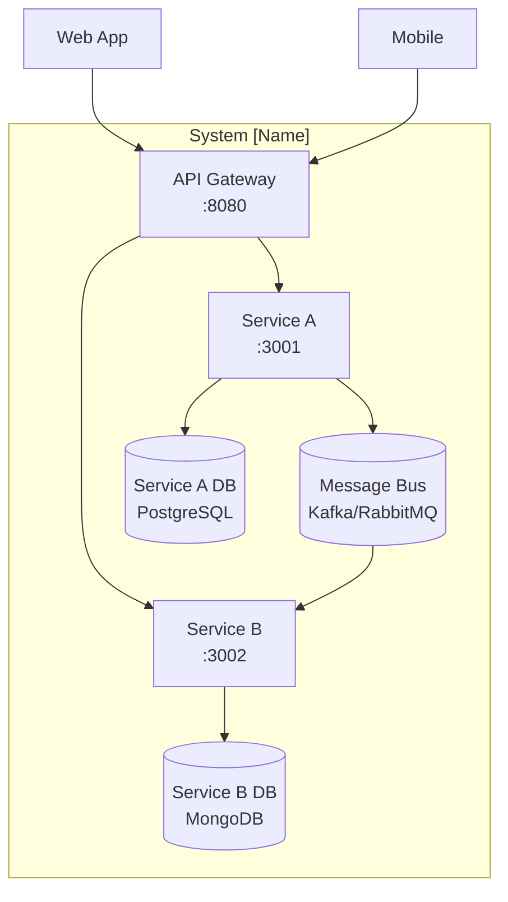

# System Architecture Overview

> **What to fill in here:** The architectural view is the technical snapshot of the system.
> It includes the C4 system and container diagram, service list, and architectural principles.
> This document is created after the main ADRs and guides the implementation.

---

## 1. Adopted architectural style

**Style:** Microservices and Event-Driven 

**Justification:** FixGo requires sub-3-second latency for emergency dispatch, independent horizontal scaling for tracking vs user authentication, and high availability during traffic spikes.
**Reference ADR:** `05-architecture/decisions/records/ADR-002-data-strategy.md`

---

## 2. C4 Diagram — System Level (Context)

> Shows how the system fits in the world. External actors and external systems.

```
┌───────────────────────────────────────────────────────────────────────────────────────┐
│                                System FixGo Platform                                   │
│                                                                                         │
│  ┌─────────────┐  ┌──────────────────┐  ┌─────────────────────┐  ┌──────────────────┐  │
│  │ auth-service│  │ service-request  │  │ geolocation-service │  │ service-execution │  │
│  │             │  │                  │  │                     │  │                   │  │
│  │ Port: 8081  │  │ Port: 8082       │  │ Port: 8083          │  │ Port: 8084        │  │
│  └──────┬──────┘  └────────┬─────────┘  └──────────┬──────────┘  └─────────┬─────────┘  │
│         │                  │                       │                       │            │
│         └──────────────────┴───────────┬───────────┴───────────────────────┘            │
│                                         │ Internal Docker Network                        │
└─────────────────────────────────────────│───────────────────────────────────────────────┘
                                          │
                        ┌─────────────────┼─────────────────┐
                        │                                   │
               ┌────────▼──────┐              ┌─────────────▼────────────┐
               │ API Gateway   │              │ Firebase RTDB / FCM       │
               │ (Nginx : 443) │              │ (live GPS + notifications)│
               └────────┬──────┘              └───────────────────────────┘
                        │
               ┌────────▼──────────────┐
               │    External clients   │
               │ (Driver & Mechanic App│
               │   via Flutter/Android)│
               └───────────────────────┘
```

> `auth-service` and `service-request` persist to the relational MySQL engine (AES-256 at rest); `geolocation-service` uses Firebase Realtime Database as an ephemeral sync layer, per `06-data/models.md`.

---

## 3. C4 Diagram — Container Level

> Shows the processes, databases, and main communication channels.

```
graph TB
    subgraph "System FixGo Platform"
        GW[API Gateway<br/>Nginx :443/:80]
        AS[auth-service<br/>Java 17 Spring Boot :8081]
        SR[service-request<br/>Java 17 Spring Boot :8082]
        GEO[geolocation-service<br/>Java 17 Spring Boot :8083]
        SE[service-execution<br/>Java 17 Spring Boot :8084]
        FCM[(Firebase Cloud Messaging<br/>Push Engine)]
        RTDB[(Firebase Realtime Database<br/>Live GPS Telemetry)]
        SQL[(MySQL — AES-256 Encrypted)]
    end

    MOB[Driver & Mechanic App<br/>Flutter / Mobile] -->|HTTPS / WSS| GW
    GW -->|Internal REST| AS
    GW -->|Internal REST| SR
    GW -->|Internal REST / WSS| GEO
    GW -->|Internal REST| SE
    AS -->|JPA / JDBC| SQL
    SR -->|JPA / JDBC| SQL
    SR -.->|ServiceRequested event| SE
    SE -.->|ServiceCompleted event| AS
    GEO -->|SDK Sync| RTDB
    GEO -->|Alert Trigger| FCM
    FCM -.->|Push Notifications| MOB
```

**Mermaid example:**



---

## 4. Service catalog

| # | Service | Responsibility | Port | DB | Communication type |
|---|---------|---------------|------|-----|-------------------|
| 1 | `api-gateway` | Edge routing, TLS 1.3 termination, rate limiting, and JWT pass-through | 443 / 80 | N/A | HTTP Reverse Proxy |
| 2 | `auth-service` | User, Driver, Mechanic, and Vehicle registration; credential validation; RBAC enforcement | 8081 | MySQL (AES-256) | REST + Events |
| 3 | `service-request` | Emergency ticket (ServiceRequest) creation, lifecycle, and status management | 8082 | MySQL (AES-256) | REST + Events |
| 4 | `geolocation-service` | Sub-3s mechanic matchmaking and live GPS coordination (15 m accuracy) | 8083 | Firebase RTDB | REST + Real-time Sync |
| 5 | `service-execution` | On-site diagnostic capture and service closure (`ServiceCompleted`) | 8084 | MySQL (AES-256) | REST + Events |

> Full detail per service in `09-microservices/service-catalog.md`

---

## 5. Architectural principles

These principles guide the project's technical decisions. Before making an important decision,
verify it is consistent with these principles.

### P1: API-First
Design the API contract (OpenAPI) before implementing the service.
Contracts are the source of truth for consumers.

### P2: Database per Service
Each service has its own dedicated data store or isolated schema. No service directly accesses another service's persistence layer.
Communication occurs exclusively through APIs or asynchronous messaging.

### P3: Fail Fast, Recover Gracefully
Detect errors early (validation at the edge via API Gateway). When an external service fails,
use Circuit Breaker patterns to prevent cascades and provide fallback responses.

### P4: Observability by Design
Structured JSON logging, health checkpoints, and error tracking are implemented
from day one across all containerized runtimes.

### P5: Sub-3s SLA Guarantee
Every dispatch query, matchmaking step, and location sync workflow must be optimized for execution under 3000 ms end-to-end to protect stranded drivers in emergency contexts.

---

## 6. Adopted architectural patterns

| Pattern | Adopted | Reference |
|---------|---------|-----------|
| API Gateway | Yes | `05-architecture/pattern-guide.md` |
| Database per Service | Yes | ADR-003 |
| Hexagonal Architecture (Ports & Adapters) | Yes | `05-architecture/hexagonal-architecture.md` |
| CQRS | No (evaluated for post-MVP scale) | — |
| Event Sourcing | No | — |
| Circuit Breaker | Yes | `05-architecture/pattern-guide.md` |
| Real-time Data Synchronization | Yes | ADR-003 |
---

## 7. Cross-cutting concerns

Transversal concerns that apply to ALL services:

| Concern | Adopted solution | Where it is configured |
|---------|----------------|------------------------|
| Authentication / Authorization | Firebase Auth + JWT validation at API Gateway | `00-governance/security-policy.md` |
| Logging | Structured JSON with contextual timestamps and error codes | Core framework logging module |
| Tracing | Correlation ID propagated via HTTP headers (`X-Correlation-ID`) | Gateway and service request interceptors |
| Health Checks | `GET /health` (liveness) + `GET /health/ready` (readiness) | Spring Boot Actuator endpoints |
| Error format | Standard ErrorResponse schema with unified error codes | `07-api/contracts/openapi/_shared.yaml` |
| Rate Limiting | Enforced at API Gateway (leaky bucket algorithm) | Nginx ingress configuration |
| CORS | Strict origin whitelisting at API Gateway | Nginx ingress configuration |
| Data Security | AES-256 encryption at rest + TLS 1.3 in transit | DB storage engine and Gateway TLS rules |

---

## 8. Registered architectural technical debt

| ID | Description | Impact | Priority | Target sprint |
|----|-------------|--------|---------|--------------|
| AT-001 | Standalone mock driver generator required to test concurrent 3-second SLA matchmaking locally | Medium | P2 | Sprint 2 |
| AT-002 | Direct Firebase SDK integration in dispatch container to be abstracted behind a modular secondary adapter interface | Low | P3 | Sprint 3 |

> See also: `15-project-control/technical-backlog.md` (pending, section 15 not yet delivered)

---

## 9. Planned evolution

| Version | Architectural change | Motivation | Estimated date |
|---------|---------------------|------------|----------------|
| v1.1 | Implement Redis distributed cache at API Gateway | Reduce redundant profile lookup latency below 50ms | Q4 2026 |
| v2.0 | Migrate internal inter-service calls to gRPC | Maximize binary throughput under severe concurrency | Q2 2027 |

---

## Key correlations

- Domain bounded contexts → `02-domain/domain-map.md`
- Specific decision ADRs → `05-architecture/decisions/records/`
- Hexagonal architecture per service → `05-architecture/hexagonal-architecture.md`
- Applied patterns → `05-architecture/pattern-guide.md`
- Per-service detail → `09-microservices/service-catalog.md`
- UML diagrams → `08-uml/`
