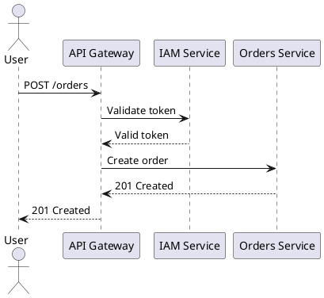
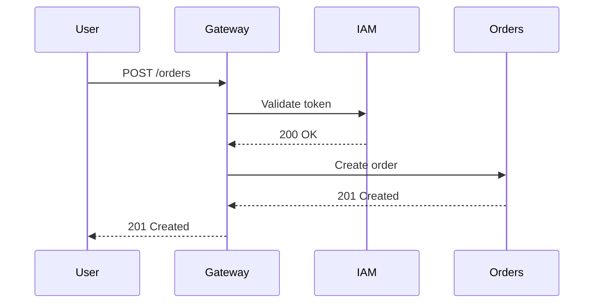

# 08 — UML Diagrams

> **What is this?** Visual representations of the system. Diagrams communicate in seconds
> what would take pages of text.

## The diagram rule

> **An outdated diagram is worse than no diagram** — it generates false confidence.
>
> Keep only the diagrams the team updates regularly. Better 3 current diagrams
> than 10 obsolete ones.

---

## Types of diagrams by purpose

### For architecture (recommended)
- **C4 — System Context (Level 1):** the system in relation to the outside world
- **C4 — Container (Level 2):** the microservices, DBs, and frontends of the system
- **C4 — Component (Level 3):** the internal components of a specific service

### For data
- **ER (Entity-Relationship):** tables and their relationships — one per service or one global

### For behavior
- **Sequence:** temporal flow of an operation that crosses multiple services
- **State:** lifecycle of an entity (e.g.: states of an order)
- **Activity:** flow of a complex business process

---

## Recommended tools

### PlantUML (for diagrams in code)


### Mermaid (supported on GitHub/GitLab)


### Draw.io / Lucidchart
For more complex diagrams requiring free placement. Export as SVG to `diagrams/exports/`.

---

## Folder structure

```
08-uml/
├── diagram-index.md          ← Registry of all diagrams
├── diagrams/
│   ├── source/               ← Source files (.puml, .drawio, .mmd)
│   └── exports/              ← Exported images (.svg, .png)
```

**Naming convention:**
- `c4-context.puml` — C4 Level 1 diagram
- `c4-containers.puml` — C4 Level 2 diagram
- `seq-login.puml` — Sequence diagram for the login flow
- `er-iam-service.puml` — ER diagram for the IAM service
- `state-order.puml` — States diagram for an order

### `diagram-index.md`
Registry of all diagrams with their purpose and location.

**Format:**
```markdown
| Diagram | Type | Source file | Last updated | Maintained by |
|---------|------|-------------|--------------|--------------|
| Global architecture | C4-L2 | c4-containers.puml | 2024-03-01 | [name] |
| Login flow | Sequence | seq-login.puml | 2024-03-01 | [name] |
```

---

## Correlations with other sections

| Fed by... | What diagram to create |
|-----------|----------------------|
| `05-architecture/overview.md` | C4 Level 1 and 2 diagrams |
| `06-data/models.md` | ER diagrams per service |
| `09-microservices/communication-patterns.md` | Sequence diagrams for flows |
| `02-domain/domain-map.md` | Bounded contexts diagram |
