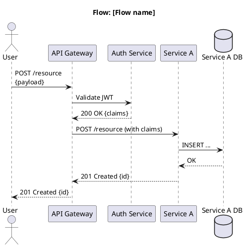
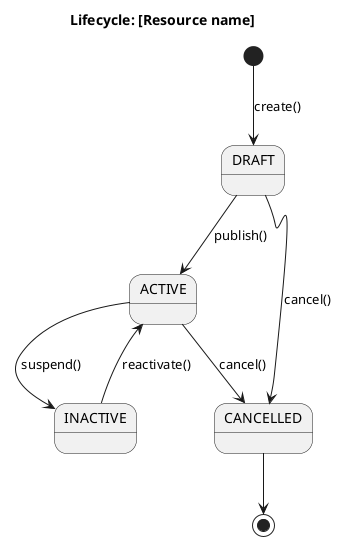
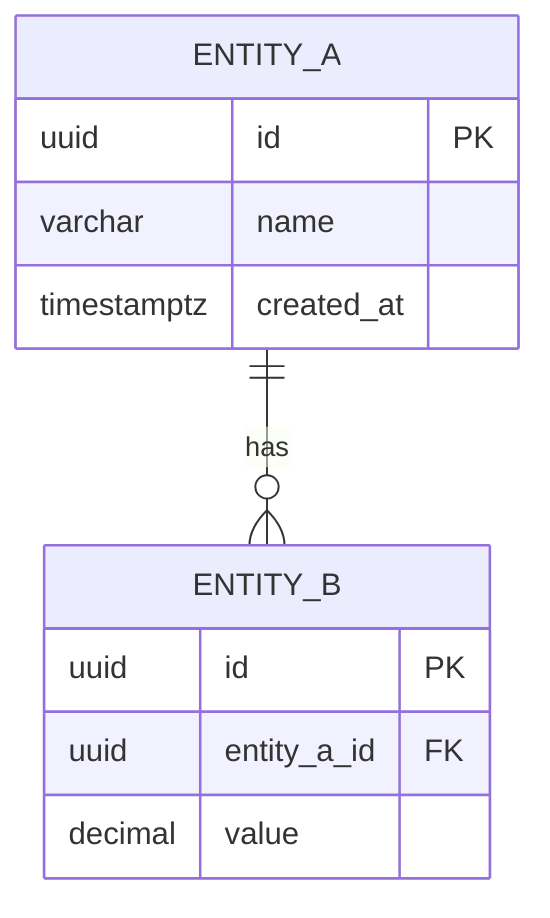

# Diagram Index

> **What to fill in here:** The registry of all system diagrams.
> Diagrams go in `08-uml/diagrams/source/` as PlantUML or Mermaid files.
> Exported renders go in `08-uml/diagrams/rendered/`.

---

## When to create a diagram?

```
✓ When the flow involves 3+ services or actors
✓ When the architecture needs to be communicated to a non-technical stakeholder
✓ When data modeling is complex (ER diagram)
✓ When a bug took more than 2 hours to understand (retroactive sequence diagram)

✗ For simple 2-element flows — code describes them better
✗ To "document for documentation's sake" — an outdated diagram is worse than none
```

---

## File naming

```
[c4-level]-[descriptive-name].[puml|mmd]

Examples:
  c1-system-context.puml
  c2-container-diagram.puml
  c3-auth-service.puml
  seq-create-order.puml
  erd-orders-service.mmd
  state-order-lifecycle.puml
```

---

## Diagram registry

### Architecture diagrams (C4)

| ID | Name | Type | Tool | Source file | Description |
|----|------|------|------|-------------|-------------|
| C4-01 | System Context | C4 L1 | PlantUML | `source/c1-system-context.puml` | The system and its external actors |
| C4-02 | Container Diagram | C4 L2 | PlantUML | `source/c2-container-diagram.puml` | All services and DBs |
| C4-03 | [Service A] Components | C4 L3 | PlantUML | `source/c3-service-a.puml` | Internal components of the service |

### Sequence diagrams

| ID | Name | Tool | Source file | Description |
|----|------|------|-------------|-------------|
| SEQ-01 | Login flow | PlantUML | `source/seq-login.puml` | Registration → Login → JWT |
| SEQ-02 | [Main flow] | PlantUML | `source/seq-[name].puml` | [Description] |
| SEQ-03 | [Error flow] | PlantUML | `source/seq-[name]-error.puml` | [Error scenario] |

### State diagrams

| ID | Name | Tool | Source file | Description |
|----|------|------|-------------|-------------|
| ST-01 | Order lifecycle | PlantUML | `source/state-order.puml` | Order states and transitions |

### ER diagrams (data)

| ID | Name | Tool | Source file | Service |
|----|------|------|-------------|---------|
| ERD-01 | Orders DB | Mermaid | `source/erd-orders.mmd` | order-service |
| ERD-02 | Auth DB | Mermaid | `source/erd-auth.mmd` | auth-service |

---

## Diagram templates

### C4 L1 — Context (PlantUML)

```plantuml
@startuml C4-Context
!include https://raw.githubusercontent.com/plantuml-stdlib/C4-PlantUML/master/C4_Context.puml

title System Context — [System Name]

Person(user, "User", "Description of the user")
Person_Ext(admin, "Administrator", "Manages the system")

System(system, "[System Name]", "Description of what it does")

System_Ext(externalSystem, "[External System]", "Description of the external system")

Rel(user, system, "Uses", "HTTPS")
Rel(admin, system, "Administers", "HTTPS")
Rel(system, externalSystem, "Sends data to", "REST API")

@enduml
```

### Sequence diagram (PlantUML)



### State diagram (PlantUML)



### ER diagram (Mermaid)



---

## Tools and rendering

| Tool | For what | How to use |
|------|---------|------------|
| PlantUML | C4, sequence, state, class diagrams | `plantuml -tsvg file.puml` |
| Mermaid | Simple diagrams in Markdown | Native support on GitHub and GitLab |
| draw.io (diagrams.net) | Complex visual diagrams | Export as XML + image |
| Structurizr | C4 model with DSL | For projects that adopt the C4 DSL |

**Rendering pipeline:**
```bash
# Render all PlantUML diagrams
find 08-uml/diagrams/source -name "*.puml" -exec plantuml -tsvg -o ../rendered {} \;

# Or with Docker (without installing PlantUML locally)
docker run --rm -v $(pwd):/data ghcr.io/plantuml/plantuml:latest \
  -tsvg -o /data/08-uml/diagrams/rendered /data/08-uml/diagrams/source/*.puml
```

---

## Correlations

- Architecture view → `05-architecture/overview.md`
- Domain bounded contexts → `02-domain/domain-map.md`
- ER models per service → `09-microservices/services/NN/data-model.md`
