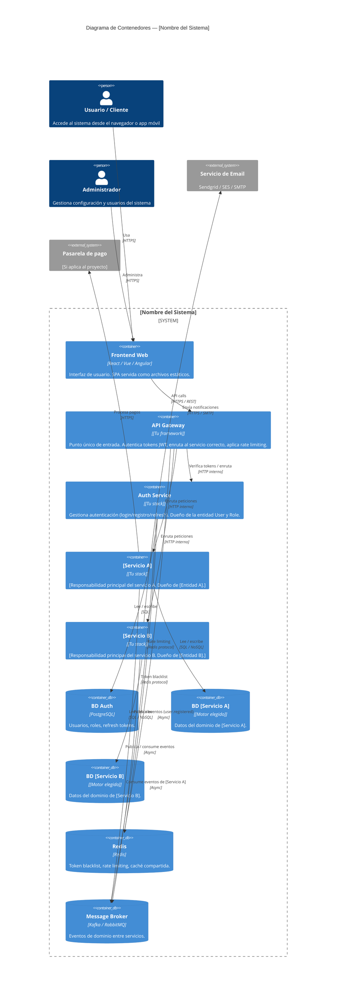

# Ejemplo: Diagrama C4 Nivel Contenedor

> Este archivo muestra cómo documentar el sistema con un diagrama C4 Level 2 (Container).
> El diagrama usa Mermaid, que renderiza nativamente en GitHub, GitLab y la mayoría de
> editores modernos (VS Code con extensión, Obsidian, etc.).
>
> **Instrucción:** Copia esta estructura, reemplaza los servicios de ejemplo (api-gateway,
> auth-service) por los servicios reales de tu proyecto, y muévelo a `diagrams/source/c4-container.md`.

---

## Sistema de ejemplo: plataforma de gestión de [X]



---

## Cómo usar este diagrama

1. **Renderizar en GitHub:** El diagrama se renderiza automáticamente al hacer push. No se necesita ninguna herramienta adicional.

2. **Renderizar en VS Code:** Instalar la extensión "Markdown Preview Mermaid Support" o usar la extensión oficial de Mermaid.

3. **Exportar como imagen:** Usar la [CLI de Mermaid](https://github.com/mermaid-js/mermaid-cli):
```bash
mmdc -i c4-container-example.md -o ../exports/c4-container.svg
```

4. **Actualizar el diagrama:** El diagrama vive en Git junto al código. Cuando cambies la arquitectura (nuevo servicio, nuevo motor de BD), actualiza el diagrama en el mismo PR.

---

## Convenciones para este proyecto

| Elemento | Color / Estilo | Cuándo usarlo |
|----------|---------------|---------------|
| `Container` | Azul | Microservicio o aplicación deployable |
| `ContainerDb` | Cilindro azul | Base de datos, caché, broker |
| `Person` | Icono persona | Actor humano |
| `System_Ext` | Gris | Sistema de terceros que no controlas |

---

## Correlaciones

- Catálogo de servicios → `09-microservices/service-catalog.md`
- Detalles de cada servicio → `09-microservices/services/`
- Índice de todos los diagramas → `08-uml/diagram-index.md`
