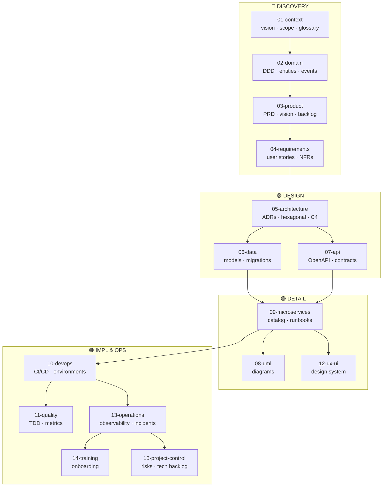

# Microservices Governance Framework

> Generic documentation template · v1.0 · MIT License
> Authored by Jesus Ariel Gonzalez Bonilla - freely licensed (MIT) for anyone.

This repository is a **documentation scaffold** for any microservices project.
It contains no project-specific information. Its purpose is to teach how to document
a software system professionally — showing what goes in each section, why it matters,
and how every document relates to the others.

---

## How to use this framework

1. **Fork** (or copy the structure) into your project repository.
2. **Pick your stack** → read `_stacks/[your-language].md` for folder structure and stack-specific commands.
3. **Follow the fill-in order** → see [`00-sdd-guide.md`](./00-sdd-guide.md) for the weekly schedule and how to split work across team members.
4. **Fill in each file** starting from sections marked as priority (⭐).
5. **Read each `README.md`** before filling in documents in that section — they explain what is expected.
6. **Do not delete instructions** until a document is fully filled in.
7. Once a document is complete and reviewed, remove the `> [!NOTE] INSTRUCTIONS` block.

---

## Build flow — section dependencies

> `00-governance` wraps the entire project and applies to every section.

---

## Section index

| # | Folder | Purpose | Phase |
|---|--------|---------|-------|
| 00 | [00-governance](./00-governance/README.md) | Team rules: Git, naming, DoD/DoR, security | ⭐ First |
| 01 | [01-context](./01-context/README.md) | Why the system exists: vision, scope, glossary | ⭐ First |
| 02 | [02-domain](./02-domain/README.md) | The business problem: entities, rules, domain events | ⭐ First |
| 03 | [03-product](./03-product/README.md) | What to build: PRD, product vision, initial backlog | ⭐ First |
| 04 | [04-requirements](./04-requirements/README.md) | What the system must do: functional & non-functional | ⭐ First |
| 05 | [05-architecture](./05-architecture/README.md) | How the system is organized: ADRs, deployment, patterns | 🔵 Design |
| 06 | [06-data](./06-data/README.md) | How data is stored: models, dictionary, migrations | 🔵 Design |
| 07 | [07-api](./07-api/README.md) | Service contracts: OpenAPI, authentication, REST guidelines | 🔵 Design |
| 08 | [08-uml](./08-uml/README.md) | Diagrams: class, sequence, component, ER | 🔵 Design |
| 09 | [09-microservices](./09-microservices/README.md) | Each microservice documented individually | 🟢 Impl |
| 10 | [10-devops](./10-devops/README.md) | CI/CD, environments, local setup, release process | 🟢 Impl |
| 11 | [11-quality](./11-quality/README.md) | Testing strategy, code review, metrics | 🟢 Impl |
| 12 | [12-ux-ui](./12-ux-ui/README.md) | Interface design: design system, flows, wireframes | 🔵 Design |
| 13 | [13-operations](./13-operations/README.md) | Production operations: observability, incidents, SLA/SLO | 🟠 Ops |
| 14 | [14-training](./14-training/README.md) | User manuals, admin guides, technical onboarding | 🟠 Ops |
| 15 | [15-project-control](./15-project-control/README.md) | Risks, dependencies, open questions, tech backlog | 🔵 Design |
| 99 | [99-archive](./99-archive/README.md) | Deprecated decisions and documents | — |

---

## Stack guides

Choose the guide that matches your project's primary language:

| Stack | File |
|-------|------|
| Java + Spring Boot | [`_stacks/java-spring.md`](./_stacks/java-spring.md) |
| Go | [`_stacks/go.md`](./_stacks/go.md) |
| Node.js + TypeScript | [`_stacks/node-typescript.md`](./_stacks/node-typescript.md) |
| Python + FastAPI | [`_stacks/python-fastapi.md`](./_stacks/python-fastapi.md) |

---

## The golden rule of documentation

> **A document nobody reads is a document that does not exist.**
>
> Before creating a document, ask: who will read it? when? what decision does it help them make?
> If you cannot answer all three questions, do not create it yet.

---

## Key cross-section dependencies

| If you change... | You must also review... |
|-----------------|------------------------|
| Scope (01-context) | PRD (03), requirements (04), architecture overview (05) |
| A domain entity (02) | Data models (06), API contracts (07), UML diagrams (08) |
| A functional requirement (04) | Acceptance criteria, test cases (11), user stories (03) |
| Architecture (05) | ADRs (05/decisions), each affected microservice (09) |
| A data model (06) | Owner service API contract (07, 09), ER diagrams (08) |
| An API contract (07) | Owner microservice (09), contract consumers (09) |
| A microservice (09) | dependency-map (09), event-catalog (09), data-ownership-matrix (09) |
| CI/CD pipeline (10) | Release checklist (10), environments (10) |

---

## Naming conventions

- **Content files:** `kebab-case.md`
- **Templates:** `_template-name.md` (leading `_` so they sort first)
- **ADRs:** `ADR-NNN-short-title.md` (sequential numbering)
- **OpenAPI contracts:** `service-name.yaml`

---

## Methodologies included

| Methodology | Primary document | Section |
|-------------|-----------------|---------|
| **SDD** (Software Design Documentation) | [`00-sdd-guide.md`](./00-sdd-guide.md) | Root |
| **DDD** (Domain-Driven Design) | [`02-domain/domain-map.md`](./02-domain/domain-map.md) | 02-domain |
| DDD — Entities, VOs, Aggregates | [`02-domain/entities-and-rules.md`](./02-domain/entities-and-rules.md) | 02-domain |
| DDD — Domain events | [`02-domain/domain-events.md`](./02-domain/domain-events.md) | 02-domain |
| **Hexagonal Architecture** | [`05-architecture/hexagonal-architecture.md`](./05-architecture/hexagonal-architecture.md) | 05-architecture |
| **Patterns** (GoF + Microservices) | [`05-architecture/pattern-guide.md`](./05-architecture/pattern-guide.md) | 05-architecture |
| **TDD** (Test-Driven Development) | [`11-quality/tdd-guide.md`](./11-quality/tdd-guide.md) | 11-quality |
| TDD — Strategy and pyramid | [`11-quality/testing-strategy.md`](./11-quality/testing-strategy.md) | 11-quality |

---

## Reference resources

- [adr.github.io](https://adr.github.io/) — Architecture Decision Records
- [12factor.net](https://12factor.net/) — Twelve-factor app best practices
- [OpenAPI Specification](https://swagger.io/specification/) — REST contract standard
- [C4 Model](https://c4model.com/) — Architecture diagrams (System, Container, Component, Code)
- [Domain-Driven Design Reference](https://www.domainlanguage.com/ddd/reference/) — Eric Evans
- [Hexagonal Architecture](https://alistair.cockburn.us/hexagonal-architecture/) — Alistair Cockburn
- [Test Driven Development](https://www.amazon.com/Test-Driven-Development-Kent-Beck/dp/0321146530) — Kent Beck

---

## License

MIT © 2026 Jesús Ariel González Bonilla
